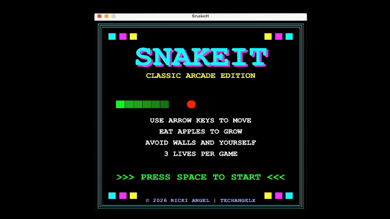
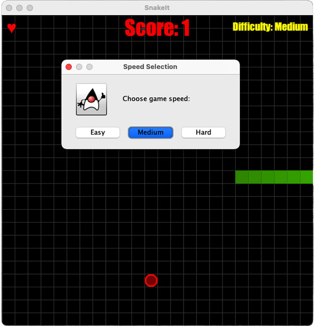
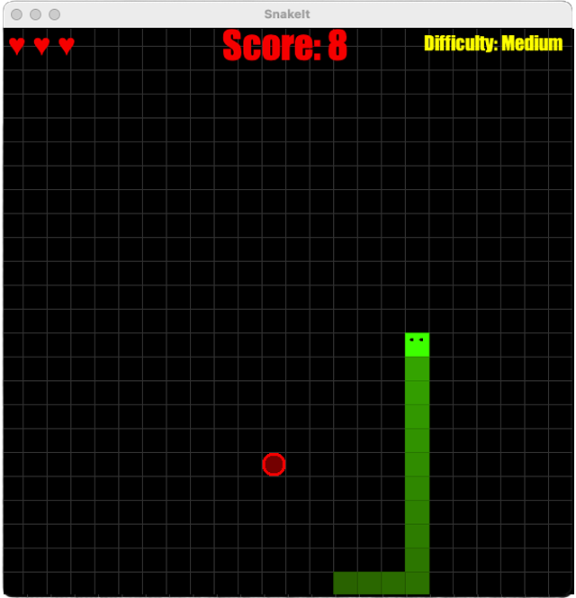
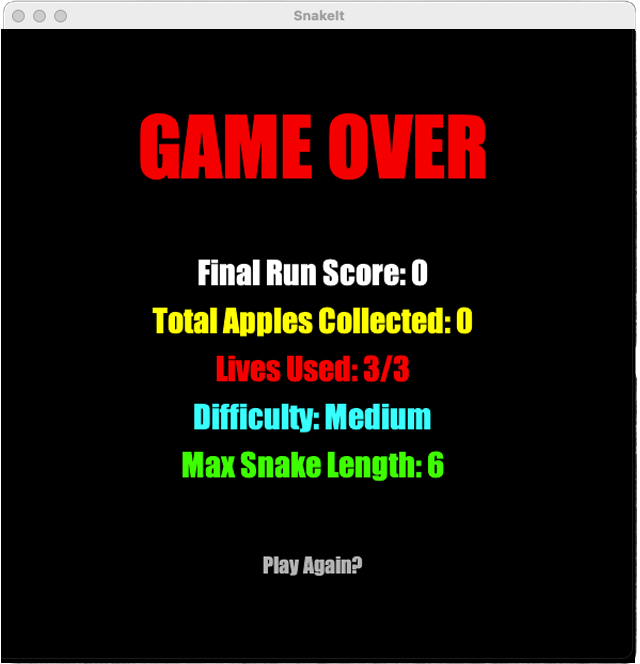

<div align="center">
  <h1>SnakeIt</h1>
  <h4>Relive your Nokia 3310 vibes !</h4>


</div>


## 🎮 Gameplay
You've played this game before. You know how it goes.
- Use the arrow keys to control the snake
- Eat apples to grow longer
- The game ends if you:
  - Hit the wall
  - Run into yourself

##  Tech Stack

- Java
- Swing GUI (old skool, I know!)
- Maven (project structure & build)

<p align="center">
  
  
</p>
<p align="center">
  
  
</p>
## 📂 Project Structure

```
SnakeIt/
├── pom.xml
├── README.md
└── src/
    └── main/
        ├── java/
        │   └── org/
        │       └── snakeIt/
        │           ├── Audio.java
        │           ├── GameFrame.java
        │           ├── GamePanel.java
        │           └── SnakeGame.java
        └── resources/
            ├── Screenshot1.png
            └── Screenshot2.png
```

## ▶️ How to Run

### Option 1: Run with Java (Quickest)

From the project root:

```bash
cd src/main/java
javac org/snakeIt/*.java
java org.snakeIt.SnakeGame
```

### Option 2: Run with Maven

From the project root:

```bash
mvn clean package
java -cp target/classes org.snakeIt.SnakeGame
```

### Option 3: Run in an IDE (Recommended)

1. Open IntelliJ IDEA or Eclipse
2. Open the `SnakeIt` folder
3. Import as a Maven project
4. Open `SnakeGame.java`
5. Right-click → Run

## ⌨️ Controls

| Key | Action |
|-----|--------|
| ↑ | Move Up |
| ↓ | Move Down |
| ← | Move Left |
| → | Move Right |


## 📚 Credits

- [Bro Code](https://www.youtube.com/watch?v=bI6e6qjJ8JQ) – Adapted from the Snake Game tutorial
- [Stack Overflow](https://stackoverflow.com/questions/34036216/drawing-java-grid-using-swing) – Java Swing grid rendering

## Contributing

Feel free to fork, experiment, and improve the project. Pull requests and suggestions are most welcome.


## License
Creative Commons:
© Ricki Angel 2026 | TechAngelX

This work is licensed under a Creative Commons Attribution-NonCommercial-NoDerivatives 4.0 International License.

## Disclaimer

This project is for personal or educational use only and comes without any warranty.
***
<h2 align="center">Support</h2>
<div align="center">
  For issues or questions, feel free to reach out to me on GitHub.
  <br /><br />
  <a href="https://techangelx.com" target="_blank" rel="noopener noreferrer">
    
  </a>
  <br /><br />
  <b>Built by Ricki Angel</b> • <a href="https://techangelx.com" target="_blank" rel="noopener noreferrer">Tech Angel X</a>
</div>
